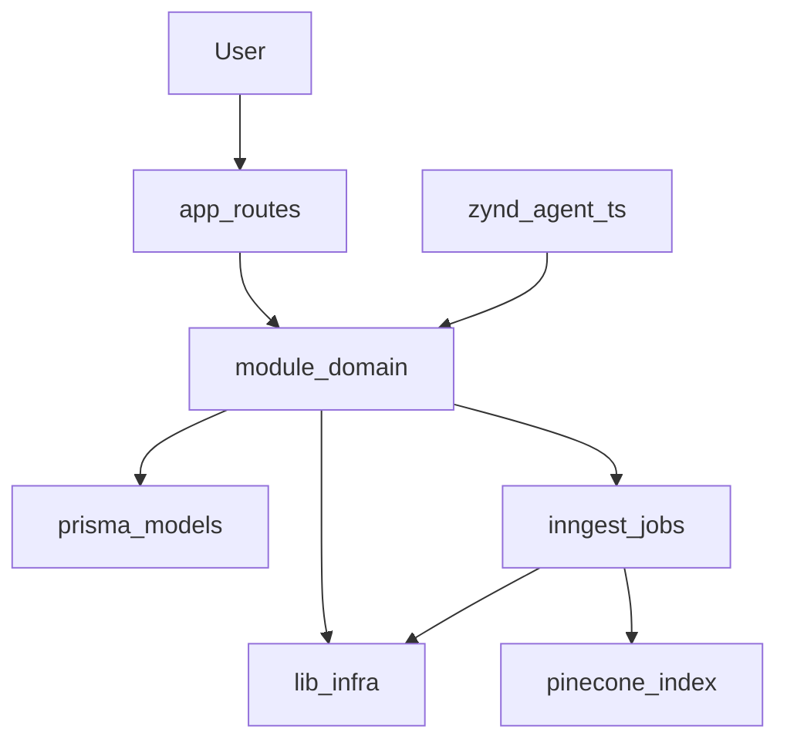

# Copilot instructions for Stitch (stitch.ai)

## Quick links for agents

- **Handbook:** `AGENTS.md`
- **Steering / priorities:** `.github/STEERING.md`
- **Facts + shipped work:** `.github/MEMORY.md`
- **Zynd standalone agent env:** `docs/zynd-agent-env.md`
- **Zynd agent code:** `agent.ts`, `payload.ts`, `agent.config.json`

## Build, lint, test

- Install: `npm install`
- Dev (Next): `npm run dev`
- Build: `npm run build`
- Start (production): `npm run start`
- Lint: `npm run lint`
- Typecheck: `npx tsc --noEmit`
- Tests: no test runner wired in `package.json` yet.

## Zynd agent (network / registry)

From repo root (loads `.env` via `dotenv` in `agent.ts`):

```bash
npx zynd agent run
```

Requires **`ZYND_AGENT_KEYPAIR_PATH`** (or private key env), **`ZYND_ENTITY_URL`** (public HTTPS origin, e.g. ngrok), LLM keys, and **`GITHUB_READ_TOKEN`** for `github_url` requests. Registration happens inside **`ZyndAIAgent.start()`** — see [Zynd registry](https://www.zynd.ai/registry) and [zyndai-ts-sdk](https://github.com/zyndai/zyndai-ts-sdk).

## Stitch — product summary

Stitch is a **GitHub-aware developer workspace** built on **Next.js App Router**. Users connect repositories, **Inngest** indexes code asynchronously, **Pinecone** stores vectors for RAG, and AI workflows produce **PR reviews** with optional repo context.

### Project agenda

1. Authenticate users and connect GitHub repositories.
2. Index connected repositories asynchronously with Inngest.
3. Store vectorized context in Pinecone for retrieval.
4. Use retrieved context in review and AI workflows.
5. **Roadmap:** subscription and usage limits during repository/review actions (schema does not yet include usage tiers — see `MEMORY.md`).

### AI agent quick navigation

- Auth: `lib/auth.ts`, `lib/auth-client.ts`, `app/api/auth/[...all]/route.ts`, `module/auth/*`
- Repository connect/disconnect: `module/repository/actions/index.ts`, `module/repository/hooks/*`, `app/dashboard/repositories/page.tsx`
- Review generation: `module/ai/actions/index.ts`, `module/review/actions/index.ts`, `app/dashboard/reviews/page.tsx`
- GitHub API: `module/github/lib/github.ts`, **`module/github/lib/octokit.ts`** (shared Octokit preset — do not use the `octokit` meta-package)
- RAG / indexing: `module/ai/lib/rag.ts`, `inngest/functions/index.ts`, `app/api/inngest/route.ts`
- Shared LLM markdown contract: **`module/ai/lib/pr-review-llm.ts`**
- Inngest PR review job: **`inngest/functions/review.ts`**
- **Zynd public agent:** **`agent.ts`**, **`payload.ts`**, **`agent.config.json`**
- Database: `lib/db.ts`, `prisma/schema.prisma`, `prisma/migrations/*`

### Stack

- Framework: **Next.js** `16.2.x` (App Router)
- Runtime: **React** `19`, TypeScript
- Styling: **Tailwind CSS v4** + **RetroUI** (`components/retroui/`)
- Auth: **better-auth**
- Database: **Prisma** + Postgres
- GitHub: **@octokit/core** + plugins via `module/github/lib/octokit.ts`
- Jobs: **Inngest**
- AI: **ai** SDK + **@ai-sdk/google** + **@openrouter/ai-sdk-provider**
- Vector DB: **Pinecone**
- Zynd network SDK: **zyndai** (`agent.ts`)

### Setup

**Prerequisites:** Node LTS recommended, Postgres, GitHub OAuth app, Pinecone key for indexing/RAG.

```bash
npm install
```

Create `.env` from `.env.example` (auth, DB, app URL, Pinecone, LLM keys; add Zynd vars if running `npx zynd agent run`).

**Database:**

```bash
npx prisma migrate dev
npx prisma generate
```

**Run Next app:**

```bash
npm run dev
```

### Scripts

| Script | Purpose |
|--------|---------|
| `npm run dev` | Next.js development server |
| `npm run build` | Production build |
| `npm run start` | Production server |
| `npm run lint` | ESLint |

### Route → feature map

| Route / file | Feature |
|--------------|---------|
| `app/page.tsx` | Landing |
| `app/(auth)/login/page.tsx` | Login |
| `app/dashboard/page.tsx` | Dashboard |
| `app/dashboard/repositories/page.tsx` | Repo connect/disconnect |
| `app/dashboard/reviews/page.tsx` | Review history / triggers |
| `app/dashboard/settings/page.tsx` | Settings |
| `app/api/auth/[...all]/route.ts` | Better Auth |
| `app/api/inngest/route.ts` | Inngest handler |
| `app/api/webhooks/github/route.ts` | GitHub webhook (minimal) |

### Data model summary (`prisma/schema.prisma`)

- **User**, **Session**, **Account**, **Verification**
- **Repository** — connected GitHub repos
- **Review** — stored AI review text per repo/PR

### Core flows

**Connect repository → indexing**

1. User connects from dashboard.
2. `module/repository/actions` persists repo + webhook.
3. Event **`repository.connected`** → Inngest **`indexRepo`**.
4. Files fetched via GitHub API → **`module/ai/lib/rag.ts`** chunks/embeds/upserts → Pinecone.

**Create review (dashboard)**

1. Flow enters via **`module/ai/actions/index.ts`** / review actions.
2. Inngest **`inngest/functions/review.ts`**: user token → **`getPullRequestDiff`** (+ optional RAG) → **`generatePrReviewMarkdown`** → GitHub comment + DB row.

**Zynd agent (public / judge)**

- **`POST /webhook/sync`** on **`ZYND_ENTITY_URL`** with body matching **`payload.ts`** (`github_url`, or `title`+`diff`, or `prompt`/`content`).
- Optional RAG: **`use_rag: true`** and server **`ENABLE_PUBLIC_RAG=true`**.

### Known gaps

- GitHub webhook route is still minimal.
- Subscription / usage limits: steering goal; not fully in schema yet.
- Full chat assistant beyond PR review: incomplete.

### Architecture (mermaid)



### Folder structure (representative tree)

Excludes `.git`, `.next`, `node_modules`:

```text
.
./agent.config.json
./agent.ts
./payload.ts
./app
./app/api
./app/api/auth
./app/api/auth/[...all]
./app/api/inngest
./app/api/webhooks
./app/api/webhooks/github
./app/(auth)
./app/(auth)/login
./app/dashboard
./app/dashboard/repositories
./app/dashboard/reviews
./app/dashboard/settings
./components
./components/ai-elements
./components/providers
./components/retroui
./components/ui
./docs
./docs/plans
./.github
./hooks
./inngest
./inngest/functions
./lib
./lib/generated
./lib/generated/prisma
./module
./module/ai
./module/ai/actions
./module/ai/lib
./module/auth
./module/auth/components
./module/auth/utils
./module/dashboard
./module/dashboard/actions
./module/dashboard/components
./module/github
./module/github/lib
./module/landing
./module/landing/components
./module/repository
./module/repository/actions
./module/repository/components
./module/repository/hooks
./module/review
./module/review/actions
./module/settings
./module/settings/actions
./module/settings/components
./prisma
./prisma/migrations
./public
```

**Optional:** `.cursor/mcp.json` — copy from `.github/mcp.json` for Cursor MCP (GitHub + ZyndAI servers).

### Folder encyclopedia (abbrev.)

| Area | Purpose |
|------|---------|
| `app/` | Routes, layouts, API handlers |
| `module/` | Feature modules (ai, auth, dashboard, github, repository, review, settings, landing) |
| `components/` | Shared UI; prefer **`retroui/`** |
| `lib/` | DB, auth, Pinecone, utilities |
| `inngest/` | Background jobs |
| `prisma/` | Schema + migrations |
| `hooks/` | Shared React hooks |
| `public/` | Static assets |
| `.github/` | Copilot instructions, steering, memory, **`mcp.json`** |

`lib/generated/prisma/` is generated — do not hand-edit.

### Zynd agent files (reference)

| File | Role |
|------|------|
| **`agent.config.json`** | Registry-facing name, description, tags, **`registry_url`**, port, skills, capabilities |
| **`agent.ts`** | `ZyndAIAgent` + **`onMessage`**: validation, GitHub fetch, LLM, optional lazy RAG |
| **`payload.ts`** | Zod **`RequestPayload`** / **`ResponsePayload`** for **`payloadModel`/`outputModel`** |

### Next.js note

<!-- BEGIN:nextjs-agent-rules -->
**This is NOT the Next.js you know** — breaking changes vs older docs. Read `node_modules/next/dist/docs/` before non-trivial framework edits.
<!-- END:nextjs-agent-rules -->
