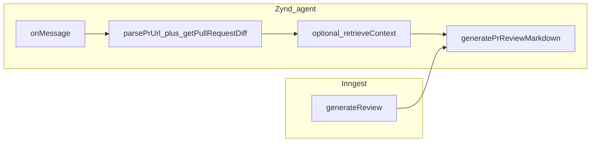

# Zynd public code-review agent (plan)

## Best approach (conclusion)

**Single shared LLM function** (`generatePrReviewMarkdown`) is the right fix: it is the smallest change that makes **Zynd** and **Inngest** produce the **same markdown contract** (walkthrough, Mermaid rules, poem, etc.) while keeping **two parallel entrypoints** — judges never hit Inngest; they hit **`POST …/webhook/sync`**.

**GitHub:** Prefer **reusing** [`getPullRequestDiff`](../../module/github/lib/github.ts) after parsing a PR URL, with a **server-only** `GITHUB_READ_TOKEN` (or reuse the same env name your team picks). Avoid duplicating Octokit diff logic in a second fetcher unless you have a strong reason.

**Zynd handler:** Remove **`setVercelAiAgent`**, **`invoke`**, and the demo **`hello`** tool. **Preferred (verified in `zyndai` 0.5.0):** implement the pipeline in **`onMessage`** and **`return { response: markdown }`** — `dispatch` calls `handle.complete(ret)` for you; you do **not** need manual `webhook.setResponse` for `/webhook/sync` on this path. **`setCustomAgent` alone** is weaker for your **`outputModel`**: the SDK `defaultHandler` wraps invoke output as **`{ text }`**, not **`{ response }`**, so strict `ResponsePayload` validation may not run. If you use `setCustomAgent`, either drop strict `outputModel` or still use **`onMessage`** to return `{ response }`.

**RAG on public route:** Gate with **`use_rag` in JSON (default false)** and an **env kill-switch** (e.g. `ENABLE_PUBLIC_RAG=true`) plus Pinecone/embedding env present; otherwise skip `retrieveContext` so demos work without vector setup.

**Registry:** Use **`description`**, **`category`**, **`tags`**, and **`skills`** for human-facing discovery on [zynd.ai/registry](https://www.zynd.ai/registry). The JSON **`capabilities`** field in **`AgentConfigSchema`** is **not** a free-form “feature list” — see verification section below.

---

## External “5 fixes” vs `zyndai` **0.5.0** (verified in `node_modules/zyndai/dist/index.js`)

This section checks the third-party review against the **installed** SDK. Pinch of salt applied: README examples can differ from A2A wire format; trust **source + one live capture** when implementing.

| # | Claim | Verdict | Evidence / action |
|---|--------|---------|-------------------|
| **1** | Callers POST `{ "content": "<string>", "sender_id": "…" }` and `content` may hold **stringified JSON** for `github_url` | **Plausible; implement explicitly** | `fromA2AMessage` builds the Zod dict from **merged `kind: "data"` parts** plus **text parts** (same string copied to **`content`** and **`prompt`**). Top-level `github_url` is natural if the HTTP layer maps the JSON body into a **data** part; if clients only send a text `content` JSON string, widen **`RequestPayload`** (e.g. accept `prompt`/`content` + `z.preprocess` / `.transform` to `JSON.parse` when needed) **or** document the A2A JSON-RPC envelope judges should use. |
| **2** | Must use `setCustomAgent` because `onMessage` needs manual `setResponse` or sync **408** | **Partially incorrect** | `dispatch` awaits the handler and calls **`handle.complete(ret)`** (`~L2527–2534`). Returning **`{ response }`** from **`onMessage`** is consistent with **`coerceHandlerOutput`** + **`outputModel.safeParse(out.data)`** (`~L2610–2618`). Manual `setResponse` is the **lower-level** `addMessageHandler` pattern from the README, not required when you return a value from the installed handler path. Prefer **`onMessage`** for `{ response }` parity. |
| **3** | Put domain features under `agent.config.json` → **`capabilities: { text: [...], input: [...] }`** | **Incorrect for this SDK** | **`ZyndBaseConfigSchema.capabilities`** only allows **`streaming`**, **`pushNotifications`**, **`stateTransitionHistory`** booleans. Extra keys **fail** `AgentConfigSchema.parse` in [`agent.ts`](../../agent.ts). Use **`tags`**, **`category`**, **`skills`**, **`description`** for “code review / PR URL” semantics; use **`capabilities`** only for those protocol toggles if desired. |
| **4** | PAT scope: `public_repo` vs **`repo`** for private PRs | **Directionally correct** | Document: **public-only demos** can use a narrow token; **private PR URLs** need a token with access (**classic `repo`**, or **fine-grained** PAT with pull + metadata read on that repository). |
| **5** | No separate “publish” step — registration in **`start()`** | **Correct** | README registration flow; **`await zyndAgent.start()`** performs registry upsert. Ops order: **`zynd init`** → env + ngrok → **`zynd agent run`** → verify **`/.well-known/agent.json`** → check [registry](https://www.zynd.ai/registry). |

---

## Feedback vs current codebase (validated)

| Claim | Accurate? | Notes |
|--------|-----------|--------|
| `agent.ts` is hello-world + generic GPT | Yes | [`agent.ts`](../../agent.ts): `hello` tool, `openai("gpt-4o-mini")`, `onMessage` → `invoke(content)` only. |
| Real review lives in Inngest only | Yes | [`inngest/functions/review.ts`](../../inngest/functions/review.ts): DB token, `getPullRequestDiff`, `retrieveContext`, inline `generateText` prompt, GitHub comment, Prisma. |
| Zynd and Inngest are parallel | Yes | No import from `agent.ts` into review logic today. |
| Need shared LLM module | Yes | Extract prompt + OpenRouter/Gemini fallback into one function both paths call. |
| `payload.ts` is only `{ prompt }` | Yes | Blocks structured `github_url` on the wire until updated ([`payload.ts`](../../payload.ts)). |
| Judges’ Postman / `content` JSON string | **See table above** | Align **`RequestPayload`** with **`fromA2AMessage`** (data merge + `content`/`prompt` strings). Capture one real **`/webhook/sync`** request after implementation and paste it into this plan’s appendix. |

**Extra finding (fix while extracting LLM):** `retrieveContext` returns **`RetrievedChunk[]`** ([`module/ai/lib/rag.ts`](../../module/ai/lib/rag.ts)), but [`review.ts`](../../inngest/functions/review.ts) interpolates `context.join("\n\n")`. That yields weak context (object stringification). The shared function should format context as **`chunks.map((c) => c.content).filter(Boolean).join("\n\n")`** (or include path labels).

---

## Target architecture

```text
TODAY (broken for judges):
  Postman → Zynd → invoke → gpt-4o-mini + hello → generic text

TARGET:
  Postman → Zynd onMessage → parse github_url → getPullRequestDiff(READ_TOKEN)
         → [optional retrieveContext if use_rag + env]
         → generatePrReviewMarkdown → { response: markdown }

  Inngest review.ts → same getPullRequestDiff(user token) + retrieveContext
                    → generatePrReviewMarkdown → post comment + DB
```



---

## Step-by-step implementation (aligned with feedback + repo)

### 1) `module/ai/lib/pr-review-llm.ts`

- Export **`generatePrReviewMarkdown({ title, description, diff, contextChunks, extraInstructions? })`** → `Promise<string>`.
- Move the **exact** review instructions from `review.ts` (walkthrough, Mermaid rules, poem, etc.) and the **OpenRouter → Gemini** `generateText` fallback here.
- **Format RAG input** from `RetrievedChunk[]` (or pre-joined string built by callers) inside this module so Inngest and Zynd do not duplicate string building.

### 2) Refactor `inngest/functions/review.ts`

- In `generate-ai-review`, replace inline prompt + `generateText` with **`await generatePrReviewMarkdown({...})`**.
- Keep all steps: `fetch-pr-data`, `retrieve-context`, `post-comment`, `save-review` unchanged aside from the LLM step and the **context formatting fix** above.

### 3) GitHub PR URL → `owner`, `repo`, `number`

- Add **`parseGithubPrUrl(url: string)`** (e.g. under [`module/github/lib/`](../../module/github/lib/) as `parse-github-pr-url.ts`): accept `https://github.com/{owner}/{repo}/pull/{n}` (and optional trailing slash / fragment); throw clear errors for issues URL or non-GitHub hosts **(v1 PR-only)**.
- **Fetch:** `const token = process.env.GITHUB_READ_TOKEN!` (Zynd process); call existing **`getPullRequestDiff(token, owner, repo, prNumber)`** — returns `title`, `description`, `diff` today ([`github.ts`](../../module/github/lib/github.ts)).

### 4) Rewrite [`agent.ts`](../../agent.ts)

- Remove **`hello`**, **`createAgent`**, **`setVercelAiAgent`**, and **`invoke`** from the hot path.
- Implement **`onMessage(async (input, task) => { ... })`** using **`input.payload`** (already **`RequestPayload`**-parsed when `payloadModel` is set) plus **`input.message.content`** if you need the raw text fallback.
- Run fetch → optional RAG → **`generatePrReviewMarkdown`**, then **`return { response: markdown }`** or **`return task.fail("…")`** on errors.
- **Imports:** Root [`tsconfig.json`](../../tsconfig.json) maps `@/*` → `./*` and includes `**/*.ts`, so `npx tsx agent.ts` from repo root can use **`@/module/...`** imports **if** your `tsx` run picks up that tsconfig (verify once; otherwise use relative imports from `agent.ts`).

### 5) [`payload.ts`](../../payload.ts) + `.env`

**Request (v1):**

- Primary: **`github_url`** (string, PR only) when present in the validated dict (from **data** parts or parsed text — see SDK verification table).
- Optional: **`extra_instructions`**, **`use_rag`** (boolean, default false).
- Legacy for manual tests: **`prompt`** / **`content`** OR **`title` + `description` + `diff`** (Zod `.refine` / preprocess so one mode is always valid).

**Response:** keep **`{ response: string }`**; use **`task.fail(...)`** from **`onMessage`** for client-visible errors.

**Env (Zynd process + document in [`.env.example`](../../.env.example)):**

- `ZYND_AGENT_KEYPAIR_PATH`, `ZYND_ENTITY_URL` (https, no trailing slash), `OPENROUTER_API_KEY`, Google key for `@ai-sdk/google`, **`GITHUB_READ_TOKEN`** (PAT with enough scope for **public** vs **private** PRs you intend to support).
- Optional RAG: Pinecone + embedding vars + **`ENABLE_PUBLIC_RAG=true`** (or similar) so public RAG is never accidental.

### 6) [`agent.config.json`](../../agent.config.json)

- Rich **`description`**, **`category`** (e.g. `developer-tools`), **`tags`** (`code-review`, `github`, `pull-request`, `markdown`, `ai`), and **`skills`** with examples mentioning **PR URL** and sync invoke.
- **`capabilities`** object (if present): only **`streaming`**, **`pushNotifications`**, **`stateTransitionHistory`** per schema — do **not** invent extra keys.

### 7) Publish / demo ops (no separate publish)

1. `npx zynd init` (once per machine).
2. Prepare **`.env`** (keypair path, model keys, optional `GITHUB_READ_TOKEN`).
3. **`ngrok http <server_port>`** → copy HTTPS origin → set **`ZYND_ENTITY_URL`** (no trailing slash).
4. **`npx zynd agent run`** → **`start()`** registers/updates the entity automatically.
5. **`GET …/health`**, **`GET …/.well-known/agent.json`** (schemas from **`payload.ts`**).
6. Open [zynd.ai/registry](https://www.zynd.ai/registry) — entity appears when process + heartbeat are healthy.
7. Postman: **`POST {{ZYND_ENTITY_URL}}/webhook/sync`** — record the **exact** winning JSON body in the appendix after you verify once.

**Timeout:** `/webhook/sync` is **~30s** in SDK docs — huge PRs may need async `/webhook` + poll or a faster model for demos.

---

## Appendix: Judge-style expectation (to validate, not assume)

Expected **outcome** (handler return → encoded in task artifact / HTTP response per SDK):

```json
{ "response": "## Walkthrough\n\n…markdown review…" }
```

**Request:** Document the exact JSON (flat vs `content` string vs JSON-RPC envelope) **after one successful** `POST …/webhook/sync` against your running agent, and paste it here so hackathon teammates do not guess.

---

## References

- [zyndai-ts-sdk README](https://github.com/zyndai/zyndai-ts-sdk)
- [Zynd docs](https://docs.zynd.ai/)
- [Registry](https://www.zynd.ai/registry)
